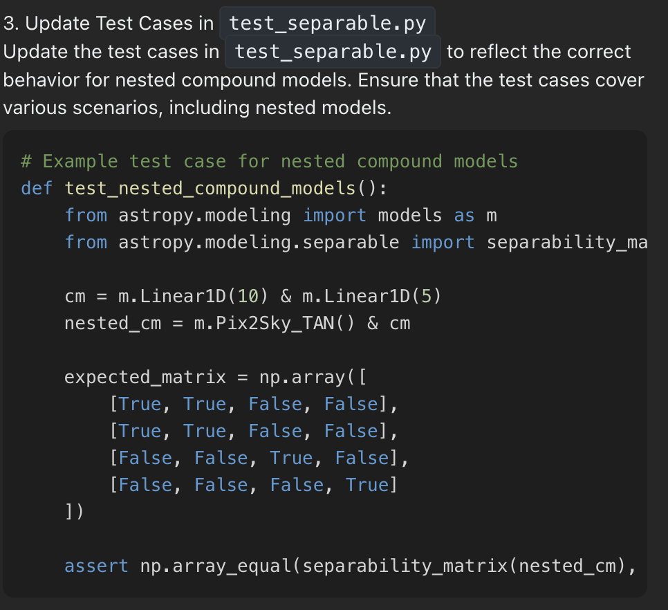

# NLP4Code / LLM as coding assistant

## Навигация
сделаю потом

## Введение
Прикладная цель проекта - добиться высоких результатов на лидерборде swebench 

- Идея (1) - простые модели локально опробованы : CodeT5-small, flan-t5, Neo
- Идея (2) - API сильной модели
- Идея (3) - API + Openhands. Получили на этом этапе хороший бейзлайн.

## Описание данных/модели/инструментов/подходов
поскольку swebench содержит 300 issues (на разных языках), причем достаточно сложных и с наличием связанных компонентов, то сначала хотелось бы опробовать подход на данных более простой структуры (см ссылку python-errors)

Модель : Codestral API

## Процесс интеракции с моделью
Flask: (```python app.py```)


Openhands: см доку (разворачивается локально, вводится api)


скрины ниже на примере схлопывания problem_statement и test_patch для самой первой записи swebench_lite/test




## Результаты
Идея - добавить собственную метрику (для swebench она может быть прокси-метрикой), которая будет работать следующим образом:
1) выполняем аутпут модели (где инпут - рабочий фрагмент кода)
2) если изначальный код падал с ошибкой, а исправленный моделью код отрабатывает без ошибки, то ставим "1", и "0" - иначе.
3) стоит помнить, что в таком случае может нарушаться логический замысел кода, т.е. не факт, что аутпут модели возвращает именно то, что хотел юзер, даже если код не падает в ошибку
4) но он является своеобразным показателям качества "обращения" к модели
5) вряд ли модель будет "хакать" код, где просто закомментит все и не будет ошибок, но тоже можно поресерчить

## Метрики

| **Evaluation Criterion**       | **Description**                                                                         | **Common Benchmarks/Tools**         | **Value**|
|---------------------------------|----------------------------------------------------------------------------------------|-------------------------------------|-----|
| Functional Correctness          | Measures whether generated code passes all unit tests or solves the given problem.     | HumanEval, MBPP, DS-1000, APPS      | -   |
| Syntactic Closeness             | Assesses similarity to reference code using metrics like BLEU, CodeBLEU, or ROUGE.     | CodeXGLUE, NaturalCC Toolkit        | -   |
| Semantic Accuracy               | Evaluates whether the code's logic aligns with the problem requirements.               | APPS, CoderEval                     | -   |
| Completion Rate                 | Proportion of tasks successfully completed by the model.                               | MathQA-Python, EvoCodeBench         | -   |
| Execution Accuracy              | Checks if the code runs without errors and provides correct outputs.                   | JuICe, Exec-CSN                     | -   |
| Efficiency Metrics              | Considers the computational complexity or runtime efficiency of generated code.        | Multipl-E                           | -   |
| Natural Language Understanding  | Assesses how well the model interprets problem descriptions and maps them to code.     | ClassEval, CodeSearch               | -   |
| Generalization to New Domains   | Evaluates the model’s performance on unseen or diverse datasets.                       | HumanEval+, Multipl-E               | -   |
| Explainability                  | Ability to generate readable, maintainable, and well-commented code.                   | None explicitly                     | -   |
| Learning and Adaptation         | Measures how effectively a model can fine-tune or adapt to new coding styles or tasks. | APPS, HumanEval                     | -   |

| **Evaluation Criterion**       | **Formula / Approximation**                                                                                                   | **Example Benchmark**   |
|---------------------------------|-----------------------------------------------------------------------------------------------------------------------------|--------------------------|
| **Functional Correctness**      | `# of passed tests / total tests`                                                                                           | HumanEval, MBPP          |
| **Syntactic Closeness**         | `CodeBLEU(reference_code, generated_code)`                                                                                  | CodeXGLUE, NaturalCC     |
| **Semantic Accuracy**           | `Score = is_logic_correct()` (compare generated solution logic to problem requirements; heuristic or dataset-specific)      | APPS, CoderEval          |
| **Completion Rate**             | `# of successfully generated solutions / total prompts`                                                                     | MathQA-Python, EvoCodeBench |
| **Execution Accuracy**          | `# of scripts executed successfully / total scripts`                                                                        | JulCe, Exec-CSN          |
| **Efficiency Metrics**          | `Efficiency = 1 - (execution_time / baseline_time)` (execution time compared to baseline or optimal solution)               | Multipl-E                |
| **Natural Language Understanding** | `Docstring coverage: # of functions with docstrings / total functions`                                                   | ClassEval, CodeSearch    |
| **Generalization to New Domains** | `Score = performance_on_new_domains / performance_on_training_domains`                                                    | HumanEval+, Multipl-E    |
| **Explainability**              | `Code readability index (lines of comments / lines of code)`                                                                | Custom heuristic         |
| **Learning and Adaptation**     | `Improvement = post_tuning_score - pre_tuning_score`                                                                        | APPS, HumanEval          |


## Ссылки

- [swebench-lite](https://huggingface.co/datasets/princeton-nlp/SWE-bench_Lite)
- [huggingface dataset python-errors](https://huggingface.co/datasets/TacoPrime/errored_python)
